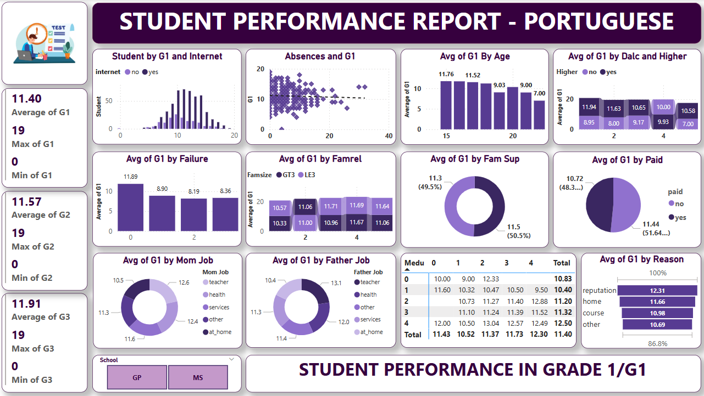
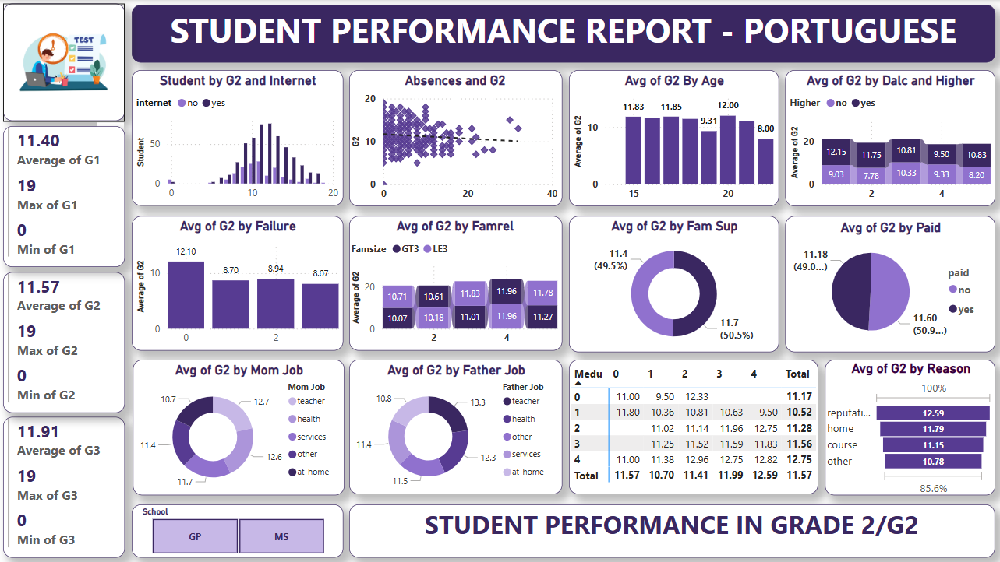
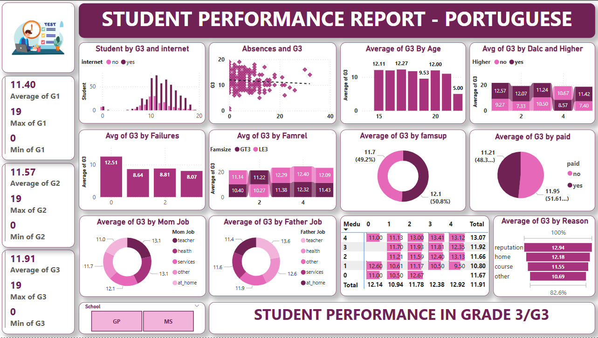

# 🎓 Student Performance Dashboard

## 🔬 Overview
This repository contains a Power BI project showcasing a **Student Performance Dashboard**. The dashboard visually represents the performance of students across different grades (Grade 1, Grade 2, and Grade 3). This README provides an explanation of the key features, metrics, and visuals used in the dashboard, ensuring anyone can understand and utilize the insights effectively.

---

## 🔍 Features
1. **🔄 Interactive Visualizations**
   - The dashboard provides interactive visuals to analyze student performance trends.
   - Filters, slicers, and clickable charts allow for in-depth exploration of data.

2. **📈 Grade-Wise Analysis**
   - Separate dashboards for Grade 1, Grade 2, and Grade 3 performance.
   - Metrics are calculated and visualized uniquely for each grade.

3. **✨ Key Metrics Tracked**
   - **🔢 Average Scores (G1, G2, G3):** Overall performance in each grade.
   - **⭐ Maximum & Minimum Scores:** Identify the best and lowest performers.
   - **📊 Absences and Their Impact:** Analyze how absences correlate with grades.

4. **🔎 Insights by Demographics & Other Factors**
   - Breakdown of performance by: 
     - **🤝 Parental Jobs (Mother’s/Father’s occupation)**
     - **🌐 Internet Access**
     - **🏡 Family Support**
     - **⏳ Study Time**
     - **💸 Paid Extra Classes**
     - **📄 Reasons for School Choice**

5. **🔄 Distribution Analysis**
   - Performance distributions across students for better understanding of data spread.
   - Clustered bar charts and pie charts for categorical insights.

---

## 🔊 Dashboard Components
### 1. **⭐ Key Performance Indicators (KPIs)**
   - **Grade 1 (G1), Grade 2 (G2), and Grade 3 (G3):**
     - Displays average, maximum, and minimum scores for each grade.

### 2. **🌐 Visuals and Charts**
   - **🔡 Scatter Plot:** Correlation between absences and grades.
   - **🔺 Bar Charts:**
     - Grade averages based on demographic factors such as age, parental jobs, and study time.
     - Comparison of G3 scores by failure count, higher education aspiration, and alcohol consumption.
   - **💧 Pie Charts:** Representation of percentage splits for variables like parental support and paid classes.
   - **🔎 Heatmaps:** Performance analysis based on student’s education level (Medu).

### 3. **🔧 Filters and Slicers**
   - **School Name Filter:** Compare performance between GP (Gabriel Pereira) and MS (Mousinho da Silveira).
   - **Grade Level Filter:** Focus on specific grades for detailed analysis.

---

## 📄 Data Source
- The dashboard utilizes a dataset containing student performance data. The data includes scores from different grades (G1, G2, G3), demographic details, and other relevant factors like internet access, parental jobs, and reasons for school choice.

---

## 🕹️ Usage
1. **Open Power BI**
   - Download the `.pbix` file for the dashboard from this repository.
   - Open it in Power BI Desktop.

2. **Explore the Dashboard**
   - Use the interactive features to explore insights.
   - Analyze performance trends and correlations.

3. **Customize as Needed**
   - Add or modify visuals as per your requirements.
   - Update data sources to analyze new datasets.

---

## 💡 Key Insights
- **🌐 Internet Access:** Students with internet access tend to have slightly better grades.
- **📝 Absences:** Higher absences correlate with lower performance.
- **🤝 Parental Influence:** Occupation of parents, especially the mother’s, has a noticeable impact on grades.
- **💸 Extra Classes:** Students attending paid classes show marginal improvements in performance.

---

## 🖼️ Screenshots
### Dashboard Preview

---

## 💨 Customization
To adapt this dashboard for other datasets:
1. Replace the data source in Power BI.
2. Update column mappings in the visuals.
3. Customize filters and slicers to reflect new data fields.

---

## 📚 Contribution
Feel free to fork this repository, make improvements, and submit a pull request. 
If you have any new visuals or enhancements with you .

---

## 👨‍💼 Author
This Power BI dashboard was developed by [Shashitha Pitchuka]. If you have any questions or need assistance or anytype of queries, please feel free to contact me.

---

